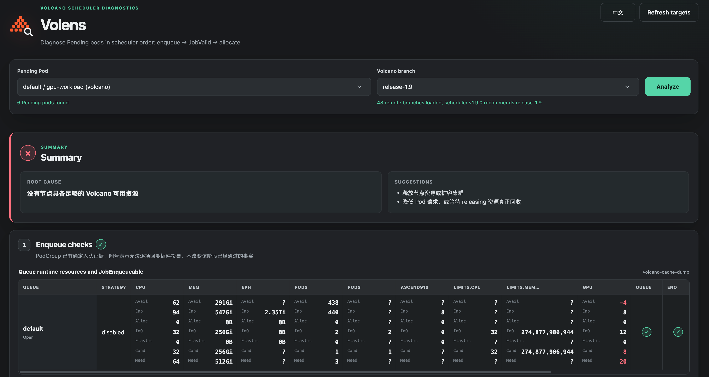

# Volens

LLM-driven diagnostics for Pods pending on the Volcano scheduler. Volens runs in-cluster, exposes a Gin-based Web/API service through `kubectl port-forward`, evaluates common scheduler rules in a stable diagnostic order, and uses operator-selected or version-matched Volcano source as a last-resort explanation path.



## What works in the first version

- Discovers Pending Pods from all namespaces and remote Volcano branches, reads the leader scheduler binary with `vc-scheduler --version` when possible, recommends a default source branch from that `Version`, and still lets an operator choose another branch in the Web UI.
- Checks Pending/unbound/non-terminating state, scheduling gates, the Pod's exact scheduler name against the current Volcano leader configuration, the canonical `scheduling.k8s.io/group-name` PodGroup association, gang `minMember`/`minTaskMember`, effective Queue existence, Pod and PodGroup enqueue Events, then active node predicates and Volcano cache resource bounds.
- Renders queue runtime resources plus JobEnqueueable checks and queue PodGroups, per-Pod JobValid checks, then per-node `free / total` resources and filter columns. `✓`, `×`, `?`, and `—` mean proven pass, proven failure, insufficient evidence, and not reached/disabled.
- Every check and every node has an explicit JSON/UI `passed: true|false`; `determinate: false` distinguishes missing/plugin-private evidence from a proven failure, `skipped: true` marks a gate that was not reached or enabled, and the report ends with one conclusion and concrete suggestions.
- Fetches the configured repository and checks out the selected remote branch in an immutable, detached, commit-specific worktree before source fallback. API clients that omit the branch retain image-tag matching compatibility.
- Supports OpenAI-compatible hosted or in-cluster inference endpoints through environment variables.
- During `/api/analyze`, calls `clusterManager.CaptureCacheDump` to derive the leader Lease name/namespace from the scheduler's runtime flags, match its holder to the discovered scheduler Pods, start a scheduler log watch, send `SIGUSR2`, and parse the resulting `Node (...)` cache dump. Lease name and namespace are not assumed.
- Derives the scheduler policy ConfigMap from the leader Pod's `--scheduler-conf` flag, volume mount, and ConfigMap volume; preserves the configured action, tier, and plugin order from the informer-cached document.
- Dynamically indexes AST-discovered `Add*Fn`/`Add*Fns` registrations, branch-specific `PluginOption` defaults, and the predicates plugin's per-filter boolean defaults from the exact selected worktree instead of assuming a fixed plugin list or defaulting omitted switches to `true`.
- Lets the LLM fallback request only analysis-scoped, sanitized Pod, PodGroup Event, Node, bounded scheduler-log, and indexed selected-source evidence through read-only tools.
- Caps LLM tool-call loops with `LLM_MAX_TOOL_ROUNDS` and the whole fallback conversation with `LLM_TIMEOUT`; round-limit, deadline, and cancellation exits explicitly recommend continuing with the selected source and scheduler logs.
- Uses typed Kubernetes objects through `client-go`; the runtime image does not contain or execute `kubectl`.

## Architecture and evidence boundary

The report follows the scheduler's configured control flow:

1. `preflight`: common task legality, scheduler identity, PodGroup presence, and the observed policy document
2. the exact `actions` order from the leader Pod's mounted scheduler ConfigMap
3. each supported action's hook phases in runtime order, then configured tier and plugin order, with the selected branch's relevant `Add*Fn` registrations and effective enable switch
4. supplemental deterministic checks for a standard action that is not configured, clearly marked as such
5. source + scheduler-log LLM analysis for remaining indeterminate checks

The analyzer does not stop at the first failed check within a stage. It collects every available check for that stage, then follows the real action boundary: a deterministic enqueue rejection marks JobValid and allocate as not reached and avoids the cache signal; a deterministic JobValid rejection similarly skips node allocation. Unknown checks do not short-circuit later evidence collection. A configured action without a complete local rule module remains `passed: false, determinate: false` instead of being omitted.

The ConfigMap UID/resourceVersion proves which API document was observed, not which bytes are already active in scheduler memory. Kubelet volume projection and Volcano's file-watch reload are eventually consistent, and an invalid reload may leave the previous configuration active. Therefore `scheduler.policy.active` remains indeterminate unless scheduler reload logs prove the transition.

Plugin callbacks depend on the scheduler's in-memory `Session`, enabled tiers, arguments, queues, jobs, ordering side effects, external extenders, and plugin-private caches. `JobEnqueueable` also uses tier voting and short-circuiting rather than a flat AND. Volens therefore does **not** dynamically compile or pretend to execute arbitrary plugin source. Common Kubernetes/cache rules and explicit scheduler Events are deterministic; unresolved active-plugin checks remain `passed: false, determinate: false` and enter the source/log LLM fallback. Runtime `.so` plugins remain unknown because their implementation is not present in the Git worktree.

Gang task counts and the standard enqueue `minResources` gate are calculated as useful evidence, but they are not marked determinate unless runtime evidence proves the relevant action/plugin path. Merely finding `gang` or another plugin in the selected source tree does not prove that the current scheduler configuration enabled it.

The scheduler Pod's tokenized `command`/`args` are inspected for repeated `--scheduler-name` and `--default-queue` flags; omitted flags use Volcano's official `volcano` and `default` defaults. Exact scheduler-name matching is used. Shell-wrapped or variable-expanded flags cannot be reconstructed safely, so those checks remain indeterminate instead of assuming a value. Likewise, `volcano.sh/job-name` is retained as useful workload metadata but is not used as a PodGroup key: Volcano's scheduler Job ID is derived from `scheduling.k8s.io/group-name`.

The implementation mirrors these boundaries under `internal/agent/validate`, `internal/agent/enqueue`, `internal/agent/filter`, and `internal/agent/runtime`. The source manager fetches the configured remote, resolves the exact selected branch/tag commit, and creates an immutable commit-specific detached worktree. Go AST parsing discovers recognized `Session.Add*Fn` registrations, resolves plugin names within their Go package, parses `ApplyPluginConfDefaults` against the selected branch's `PluginOption` YAML tags, and links each predicates `args.GetBool` key to its selected-branch default. Explicit ConfigMap `predicate.*Enable` values override those defaults one table column at a time. A bounded source subset is placed in the prompt; the model can read any remaining indexed file through a worktree-contained read-only tool.

For resources, `Agent.Analyze` calls the public `clusterManager.CaptureCacheDump` method. That method discovers the leader, opens its scheduler log stream before sending `kill -s USR2 1`, collects the bounded dump, and parses `allocatable`, `idle`, `used`, and `releasing`. The node table shows `idle / allocatable`. Volcano actually gates on `FutureIdle = Idle + Releasing - Pipelined`, while the standard dump omits `Pipelined`; therefore only a request that exceeds even `idle + releasing` is a deterministic resource failure, and a possible fit remains unknown. CPU and scalar values from the dump are divided by 1000 to match Kubernetes quantities; memory remains bytes. A missing device dimension is displayed as `? / total` when Kubernetes allocatable still exposes it, rather than being treated as zero. A missing or partial dump never silently falls back to Node allocatable and claims a scheduling result.

Kubernetes clients are created from one `rest.InClusterConfig()`: a typed client serves core resources and a dynamic client serves Volcano `scheduling.volcano.sh/v1beta1` CRDs without a compile-time Volcano API dependency. Long-lived Pod, Node, ConfigMap, PriorityClass, PodGroup, and Queue informers serve normal reads from local caches; dedicated Pod and PodGroup indexes track scheduler identity, image changes, workload membership, and queue membership. The PriorityClass informer resolves a PodGroup's `priorityClassName` to the numeric priority used in queue ordering, including the cluster default priority. The scheduler is recognized by exact standard labels/container names or an exact `vc-scheduler`/`volcano-scheduler` image or command basename, avoiding exporter substring matches. Absence of any recognizable Pod remains indeterminate, while a recognized but non-Ready scheduler is a deterministic failure. In an HA deployment, the manager parses `--scheduler-name`, `--leader-elect`, and `--lock-object-namespace`, then performs only the derived Lease `GET`; this avoids watching high-churn Node Leases cluster-wide. Pod and PodGroup Events remain on-demand, UID/field-selected API queries because caching every short-lived cluster Event would add substantial churn. Scheduler log following and the narrowly scoped `SIGUSR2` exec are used by cache capture; the final LLM fallback can separately request only a bounded tail from the discovered scheduler leader. Standard `KUBECONFIG` loading is the local-development fallback when the process is not running inside a Pod.

Queue runtime resources are reconstructed locally from the same SIGUSR2 cache dump. Volens parses `JobInfo` and `TaskInfo` lines emitted by Volcano's `pkg/scheduler/cache/dumper.go`, combines them with Queue and PodGroup informer snapshots, and applies the proportion/capacity enqueue formula locally: `realCapability = min(totalNodeAllocatable - totalQueueGuarantee + thisQueueGuarantee, queue.spec.capability)`, then checks the candidate against `realCapability - allocated - inqueue + elastic`. CPU and scalar values from the dump are divided by 1000 to match Kubernetes quantities; memory remains bytes. Missing cache fields remain unknown/indeterminate and are never converted to zero or a passing check.

## Run locally

```bash
go test ./...
KUBECONFIG="$HOME/.kube/config" go run ./cmd/volens
kubectl port-forward deployment/volens -n volcano-system 8080:8080
```

Open <http://localhost:8080>.

The supplied manifests intentionally do not create a Service. A deny-ingress NetworkPolicy keeps the privileged analysis endpoint off the cluster network; use Kubernetes RBAC-controlled `port-forward` for access. If the API is exposed through an Ingress or Service, add authentication, authorization, TLS, and request-rate controls at that boundary.

## Image and deployment

```bash
docker build -t your-registry/volens:latest .
kubectl apply -f deploy/volens.yaml
```

The image build mirrors the public Volcano repository and materializes it as a complete, writable, non-bare clone at the default `VOLENS_SOURCE_DIR`. The mirror keeps upstream refs and objects, while explicit `origin/*` refs make branch discovery work even when runtime fetching is temporarily unavailable. The build argument `VOLCANO_SEED_REPO_URL` changes this public seed source; do not pass a credential-bearing private URL as a build argument because image build metadata can retain it.

At startup, the entrypoint uses the image seed when its `.git` directory is present, updates only the `origin` URL and fetch refspec from `VOLCANO_REPO_URL`, and leaves fetching to the running service. This avoids an unconditional network request on every Pod start. It clones with `--no-single-branch` only when the configured source directory has no image seed, for example when an empty writable volume replaces that path. A non-empty path without a valid repository fails instead of being overwritten.

`GET /api/branches` fetches and prunes the configured `origin` before listing its branches. Managed remote branches and tags use forced explicit refspecs, so switching to a fork/private remote safely replaces divergent same-name seed tags and prunes seed-only tags. When source fallback is needed, the selected branch is fetched again, resolved to an exact commit, and opened in a detached commit-specific worktree. Automatic image-tag matching uses only explicit `refs/tags/*` and freshly fetched `refs/remotes/origin/*`, never stale seed-local branches. A branch that no longer exists fails explicitly and never silently falls back to `master`. Set `VOLCANO_GIT_UPDATE=false` only when intentionally using the image's cached refs; after changing `VOLCANO_REPO_URL`, leave updates enabled so private or fork-specific refs replace the public seed refs.

Commit-specific worktrees are deliberately never mutated while another analysis may still be reading them. They live under the source directory for the Pod lifetime; recycle that workspace periodically if it is backed by persistent storage and remote branches move frequently.

For private repositories, keep the public seed in the image and supply runtime credentials with a mounted SSH key and `known_hosts`, or an HTTPS credential helper. Set `VOLCANO_REPO_URL` to that private remote at runtime; the entrypoint reconfigures `origin`, and the service fetches with the mounted credentials. Do not put tokens in the Docker build arguments or directly in the Deployment YAML.

The Deployment manifests reference a `volens-llm` Secret but intentionally do not contain its value. Create and rotate that Secret out of band, preferably through the cluster's secret-management system; never commit a provider key or its base64 representation.

The supplied ClusterRole grants `get/list/watch` on `scheduling.k8s.io/priorityclasses` for the PriorityClass informer. Queue and node runtime snapshots use scheduler log following plus the narrowly scoped `pods/exec` `create` permission needed to send `SIGUSR2` to the discovered scheduler leader.

## Configuration

| Variable | Default | Meaning |
|---|---|---|
| `VOLENS_ADDR` | `:8080` | HTTP listen address |
| `VOLENS_ANALYZE_TIMEOUT` | `15m` | overall deadline for one analysis; each Volens Pod accepts one active analysis and returns HTTP 429 for overlap, avoiding duplicate cache signals, source updates, and LLM work |
| `KUBECONFIG` | empty | Standard client-go local-development fallback; in-cluster config is the runtime default |
| `GIN_MODE` | `release` | Gin mode |
| `VOLCANO_REPO_URL` | official GitHub repository | Volcano remote URL |
| `VOLCANO_GIT_UPDATE` | `true` | fetch before listing branches and preparing source; `false` uses cached refs |
| `VOLENS_SOURCE_DIR` | `/var/lib/volens/volcano` | full Git clone location |
| `LLM_BASE_URL` | empty | API base URL; can be an in-cluster Service |
| `LLM_API_KEY` | empty | bearer token |
| `LLM_MODEL` | `gpt-4.1-mini` | model sent to the endpoint |
| `LLM_MAX_TOOL_ROUNDS` | `4` | maximum LLM tool-call rounds; invalid/non-positive values use 4 and values above 16 are capped at 16 |
| `LLM_TIMEOUT` | `10m` with 4 rounds | Go duration and the sole built-in deadline for the whole LLM conversation, including inference requests and tools; when unset/invalid/non-positive it defaults to `(LLM_MAX_TOOL_ROUNDS + 1) * 2m` |

## API

- `GET /api/pods`
- `GET /api/branches`
- `POST /api/analyze` with `{"namespace":"default","pod":"pending-pod","branch":"release-1.12"}`
- `GET /healthz`

`branch` is optional for compatibility with existing API clients. If omitted, source fallback uses the scheduler image tag and retains the historical `origin/master` fallback. If explicitly supplied, only that exact remote branch is accepted. Source preparation and LLM errors remain visible in the report.
