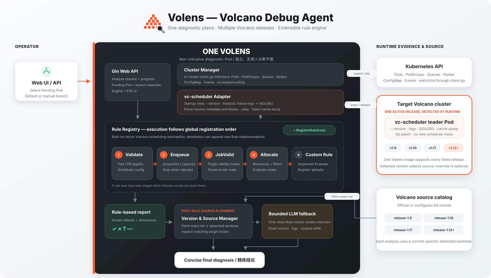
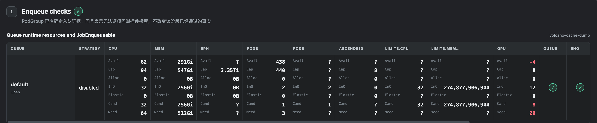
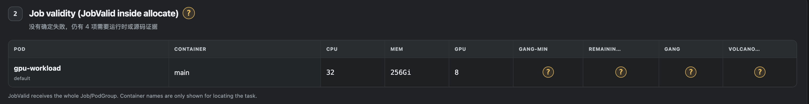
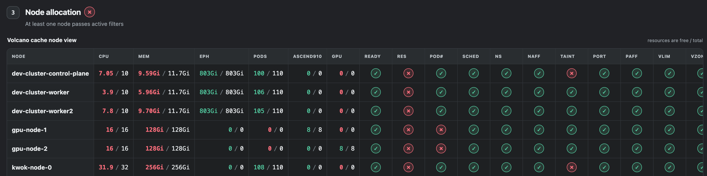
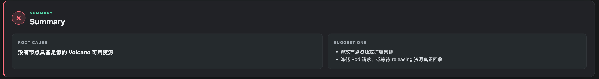

# Volens

[English](README.md) | [简体中文](README_zh.md)

Volens 是一个面向 Volcano 调度器 Pending Pod 的 LLM 辅助诊断工具。它以 Pod 形式运行在目标集群中，用户可以通过 Web 页面选择故障 Pod，按照调度流程查看检查结果，并获得精炼的根因与处理建议。

Volens 只读取 Kubernetes 工作负载，不会修改或替换 `vc-scheduler`。它能够探测当前 scheduler 版本，并在分析时使用匹配的 Volcano 源码分支，因此同一个 Volens 镜像可以支持多个 Volcano 版本。

## 架构

一个 Volens 实例即可适配多个 Volcano 版本。它通过 in-cluster `client-go` 获取 Kubernetes 资源，从当前 `vc-scheduler` 获取版本和缓存证据，依次执行已注册的诊断 Rule；需要深入分析时，再使用与版本对应的 commit-specific Volcano 源码 worktree。



## 主要能力

- 按调度顺序执行诊断：**入队 → JobValid → 节点分配**。
- 展示队列容量和入队证据，并直接指出阻塞入队的资源维度。
- 按节点展示 CPU、内存、Pod 数、GPU/NPU 等 `free / total` 资源，以及污点、亲和性、端口、存储卷等已启用过滤项。
- 使用清晰的结果符号：`✓` 通过、`×` 失败、`?` 证据不足、`—` 未启用或未执行。
- 最终只给出精炼根因和少量操作建议，不展示冗长的大模型推理文本。
- 自动探测 Volcano 版本并推荐源码分支，同时允许在页面手动选择分支。
- 优先使用确定性 Rule；只有常规检查无法判断时，才基于匹配源码和日志调用 LLM。

## 效果展示

### 入队检查

查看目标队列的实际容量、已分配和已入队资源、当前 PodGroup 请求，以及具体不满足的资源维度。



### JobValid 检查

在节点分配前查看 Pod/PodGroup 资源以及当前启用的 `JobValid` 检查结果。



### 节点分配

将 Pod 请求与每个节点的 Volcano cache 资源及过滤项进行对比，不满足的资源值会直接标红。



### 最终结论

报告最后给出一个明确根因和少量建议操作。



## 快速开始

### 前置条件

- Kubernetes 集群中已经安装 Volcano。
- 有权限创建 `deploy/volens.yaml` 中的 ServiceAccount、ClusterRole、ClusterRoleBinding、Deployment 和 NetworkPolicy。
- 集群能够拉取 Volens 镜像。
- 启用分支更新时，Volens Pod 能够访问配置的 Volcano Git 仓库。
- 只有需要 LLM 兜底分析时才需要 OpenAI-compatible 推理服务；没有配置 LLM 时，确定性检查仍可正常使用。

### 1. 构建并推送镜像

```bash
docker build -t <registry>/volens:<tag> .
docker push <registry>/volens:<tag>
```

修改 `deploy/volens.yaml` 中的镜像：

```yaml
containers:
  - name: volens
    image: <registry>/volens:<tag>
```

### 2. 配置推理服务

需要 LLM 兜底分析时，在 `deploy/volens.yaml` 中设置：

```yaml
- name: LLM_BASE_URL
  value: "http://inference.default.svc:8000"
- name: LLM_MODEL
  value: "your-model"
```

如果推理服务需要密钥，创建 Deployment 引用的 Secret：

```bash
kubectl -n volcano-system create secret generic volens-llm \
  --from-literal=api-key='<api-key>'
```

不要将供应商密钥直接写入清单或镜像。

### 3. 部署 Volens

```bash
kubectl apply -f deploy/volens.yaml
kubectl -n volcano-system rollout status deployment/volens
```

默认清单不会创建 Service。通过受 Kubernetes RBAC 控制的端口转发访问：

```bash
kubectl -n volcano-system port-forward deployment/volens 8080:8080
```

浏览器打开 [http://localhost:8080](http://localhost:8080)。

### 4. 发起分析

1. 选择一个 Pending Pod。
2. 使用推荐的 Volcano 分支，或者手动选择其他远程分支。
3. 点击 **Analyze**。
4. 从上到下查看入队、JobValid、节点分配和最终结论。

如果入队阶段已经确定失败，后续阶段会显示为未执行，因为 Volcano 此时不会继续为该 PodGroup 分配节点。

## 常用配置

| 环境变量 | 默认值 | 作用 |
|---|---|---|
| `VOLCANO_REPO_URL` | `https://github.com/volcano-sh/volcano.git` | 用于版本匹配分析的 Volcano 源码仓库 |
| `VOLCANO_GIT_UPDATE` | `true` | 准备源码前更新远程分支和 tag |
| `LLM_BASE_URL` | 空 | OpenAI-compatible 托管或集群内推理服务地址 |
| `LLM_API_KEY` | 空 | 可选 Bearer Token，通常从 Secret 加载 |
| `LLM_MODEL` | `gpt-4.1-mini` | 请求推理服务时使用的模型名称 |
| `LLM_MAX_TOOL_ROUNDS` | `4` | 一次 LLM 兜底分析允许的最大源码/日志工具轮次 |
| `LLM_TIMEOUT` | `10m` | LLM 兜底分析的总超时时间 |
| `VOLENS_ANALYZE_TIMEOUT` | `15m` | 单次完整分析的总超时时间 |
| `VOLENS_ADDR` | `:8080` | HTTP 监听地址 |

使用私有 Volcano 仓库时，请挂载 SSH 凭据和 `known_hosts`，或者使用 HTTPS credential helper。不要在提交到仓库的清单中把凭据写入 `VOLCANO_REPO_URL`。

## 从源码运行

本地开发时，需要提供 kubeconfig 和一个可写的 Volcano clone：

```bash
git clone https://github.com/volcano-sh/volcano.git ../volcano
KUBECONFIG="$HOME/.kube/config" \
VOLENS_SOURCE_DIR="$(pwd)/../volcano" \
go run ./cmd/volens
```

然后打开 [http://localhost:8080](http://localhost:8080)。

## HTTP 接口

- `GET /healthz`
- `GET /api/pods`
- `GET /api/branches`
- `POST /api/analyze`

示例：

```bash
curl -X POST http://localhost:8080/api/analyze \
  -H 'Content-Type: application/json' \
  -d '{"namespace":"default","pod":"pending-pod","branch":"release-1.12"}'
```

`branch` 字段可选。省略时，Volens 会根据探测到的 scheduler 版本自动选择源码。
